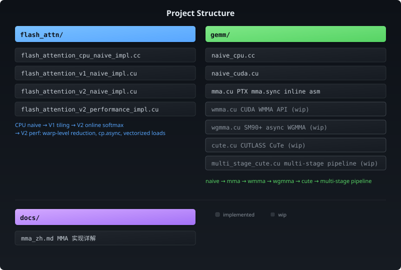

# LLM Kernel Lab

> FlashAttention · GEMM · CUDA · Tensor Core · CUTLASS · CuTe

个人学习与实践仓库，专注于 CUDA 高性能算子开发，探索 FlashAttention、GEMM、Tensor Core 编程以及现代 GPU Kernel 优化技术。

🌎 **English Version:** [README.md](./README.md)

---

# 追求技术的道路是泥泞的，但我始终怀有一腔热忱

## 引言

性能优化是一个很大的话题。

让一个程序“能跑”并不难，而让它在有限资源下跑到极致，却往往需要跨越算法、系统和硬件之间的鸿沟。

在我看来，性能优化大致可以分为三个层次：

### 芯片

深入理解硬件是性能优化的前提。

通用算子可以获得不错的性能，但很难超越芯片厂商针对特定场景设计的定制实现。当算法成熟、生态稳定、商业模式跑通之后，ASIC 往往会迎来新一轮爆发。

### 系统

如果说芯片提供的是算力，那么系统架构负责调度这些算力。

异构计算已经成为 AI 系统的标配。数据搬运、任务并行、结果回写，这些流程本身并不复杂；真正困难的是如何从全局视角统筹 CPU、GPU、NPU、内存等有限资源，在降低延迟的同时提升整体吞吐。

系统的价值，不在于让模型跑起来，而在于让模型高效地服务用户。

### 算法与模型

算法和模型决定了性能优化的上限。

是选择参数规模更大的模型，还是选择更轻量化的结构；是追求极致精度，还是追求更低的延迟；量化、剪枝、蒸馏等技术如何取舍，这些问题没有统一答案。

低精度模型、高准确度结果，始终是量化领域不断追求的目标。

---

## 为什么是 FlashAttention

第一次读到 FlashAttention 论文时，我最大的感受并不是它快，而是它背后体现出的工程深度。

Online Softmax 来源于算法创新；

多阶段流水线来源于系统设计；

Tensor Core、TMA 等硬件特性的充分利用，则建立在对 GPU 架构的深入理解之上。

它不是某一个层面的优化，而是一次自下而上的系统性突破。

也正因如此，FlashAttention 对我而言不仅仅是一篇论文，更是一种工程思想的体现。

当时我意识到：

如果没有亲手实现过这些优化，仅仅阅读论文、分析源码，终究无法真正理解它们。

> 纸上得来终觉浅，绝知此事要躬行。

于是，这个仓库诞生了。

这里记录着我在 CUDA、GEMM、FlashAttention 等方向上的学习、实践与思考，也记录着我尝试复现和理解那些优秀工作的过程。

---

## 项目结构

  

### 🐭 FlashAttention

从基础实现开始，逐步引入不同优化策略，探索现代 Attention Kernel 的设计方法。

👉 [进入 FlashAttention](./flash_attn/README_zh.md)

### 🐭 GEMM

围绕矩阵乘法展开，研究 CUDA Kernel 优化、Tensor Core 编程、CUTLASS、CuTe 等相关技术。

👉 [进入 GEMM](./gemm/README_zh.md)

---

## 仓库目标

这个仓库并不是为了追求功能完整，也不是为了实现工业级框架。

更希望通过亲手实现和验证：

* FlashAttention 系列算法
* GEMM 优化技术
* Tensor Core 编程模型
* CUDA Kernel 优化技巧
* CUTLASS / CuTe 设计思想
* GPU 架构相关知识

去理解那些优秀工作的设计逻辑，而不仅仅停留在“知道它是什么”。

---

如果这些实践记录能够帮助后来者少走一些弯路，那将是一件非常有意义的事情。

也希望自己始终保持对技术最初的热爱。
