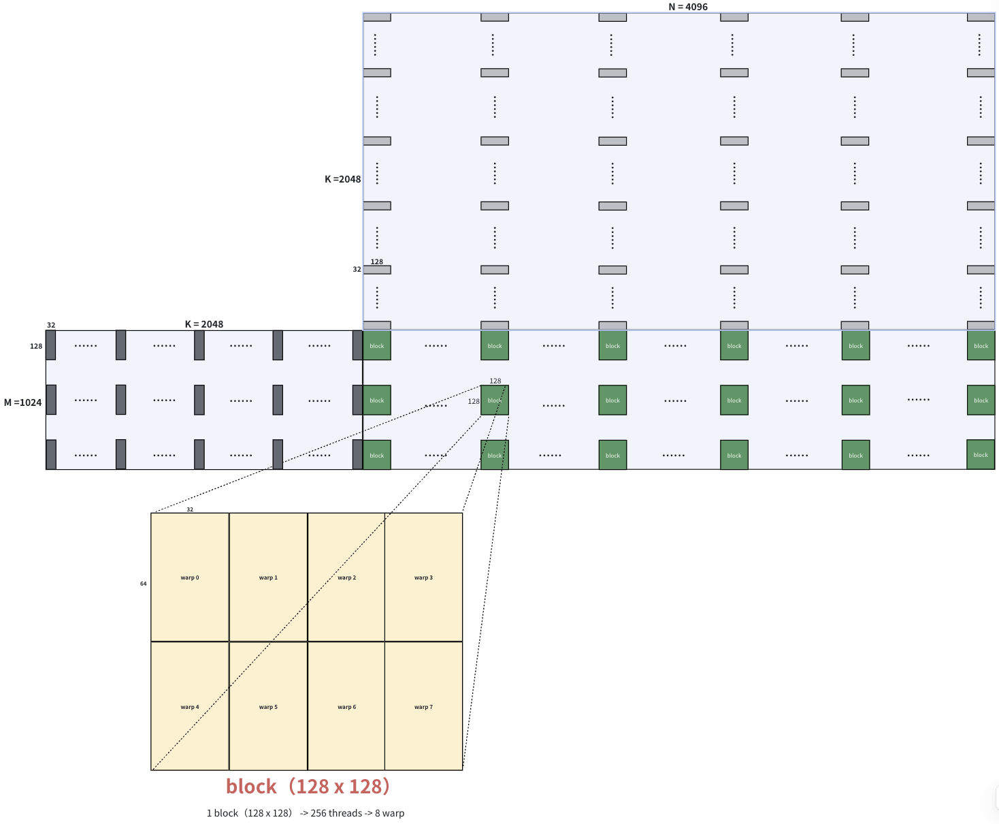
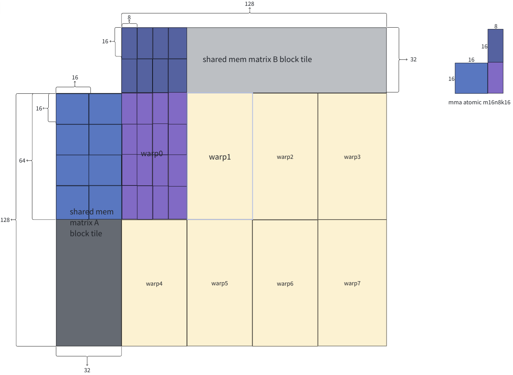
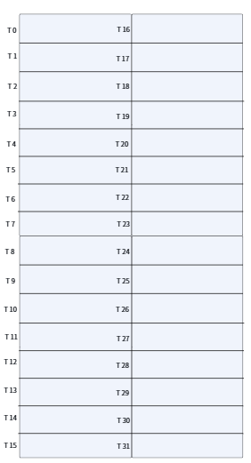

# mma

## 基本参数
MxKxN = 1024x2048x 4096: 矩阵C(1024, 4096) = 矩阵A(1024, 2048) x 矩阵B(2048, 4096)  
TensorCore ISA AtomicMMA: m16n8k16  
Cuda Block Dim: 128x128  
warp: 8

## 实现思路
**CUDA Grid / Block**  
各cuda block(128, 128)负责计算矩阵C的局部数值，该局部结果依赖矩阵A的部分行与矩阵B的部分列乘加计算。考虑到K维度(2048)太大，片上共享内存大小无法一次将其装载（即使可以全部加载也会影响SM Occupancy），还需额外将矩阵A、矩阵B对应的部分行与列以BLOC_M(128) x BLOCK_K(32)， BLOCK_K(32) x BLOCK_N(128)维度划分小块，逐一计算两小块乘加结果并累加至相应block区域。

**全局内存到共享内存的数据搬运**  
每个cuda block包含8 warp(256 thread)，所有线程以向量化方式参与加载矩阵A小块smem_A_tile(128x32)，矩阵B小块smem_B_tile(32x128)到共享内存中。

**Warp工作单元块**  
128x128 cuda block 按WARP_TILE_M(64) x WARP_TILE_N(32)维度划分，8个warp刚好分配完。

**Tensor core计算**  
就单个warp负责的 64x32 warp_tile，其结果依赖共享内存上 smem_A_tile 64x32 与 smem_B_tile 32x32 mma。又因为选用的 Tensor Core MMA Atom 是 m16n8k16，所以smem_A_tile被分成了 4x2，smem_b_tile 2x4 的格局，外层两次主循环节即可完成 64x32 warp_tile mma。

    
    

## 优化说明与分析
### 向量化加载提高带宽利用率
- 单个线程一次可读写float4类型数据(16 Bytes)，而 smem_A/B_tile 均存储 half 类型，意味着单线程一次可搬运8个 half(16 Bytes)，即 kVecSize = 8
- smem_A_tile 共 BLOCK_M x BLOCK_K = 4096 half，smem_B_tile 共 BLOCK_K x BLOCK_N = 4096 half，256个线程单次搬运2048个 half，2次即可搬运全部数据

### ldmatrix的使用
- SM80 Amphere 架构限制Tensor Core必须从寄存器加载数据进行矩阵运算
- 从 BLOCK_K(32) 维度，按 kAtomicMMA_k(16) 划分smem_A_tile左右，smem_B_tile上下两部分。先遍历smem_A_tile的左半部分，smem_B_tile的上半部分；再遍历smem_A_tile的右半部分，smem_B_tile的下半部分
- A atom matrix，kAtomicMMA_m(16) x kAtomicMMA_k(16) 256个 half，平均分给warp中的32个线程，每个线程分到8个 half，即用4个32位寄存器接住；同理，对B atom matrix，kAtomicMMA_k(16) x kAtomicMMA_n(8)，每个线程用2个32位寄存器接住
- ptx汇编指令ldmatrix
    - m8n8.x4，硬件规定最小的原子读取块(8x8)的微矩阵，目标矩阵16x16正好可以被“切蛋糕”一般分成4块。32个线程，前16个线程负责左半边，后16个线程负责右半边。计算出对应的共享内存的物理地址，移交给硬件单元LSU(Load/Store Unit)接管，LSU一次性从shared memory抽出512 Bytes数据，自动且精确地将16 Bytes直接写入到32个线程对应的寄存器中
    - m8n8.x2给目标矩阵16x8使用，只要前16个线程提供共享内存地址。后16个线程，只需提供从共享内存搬运回来的寄存器地址，共享内存地址硬件LSU会直接忽略

    

### Swizzle 缓解 Bank Confilict

### 写回

